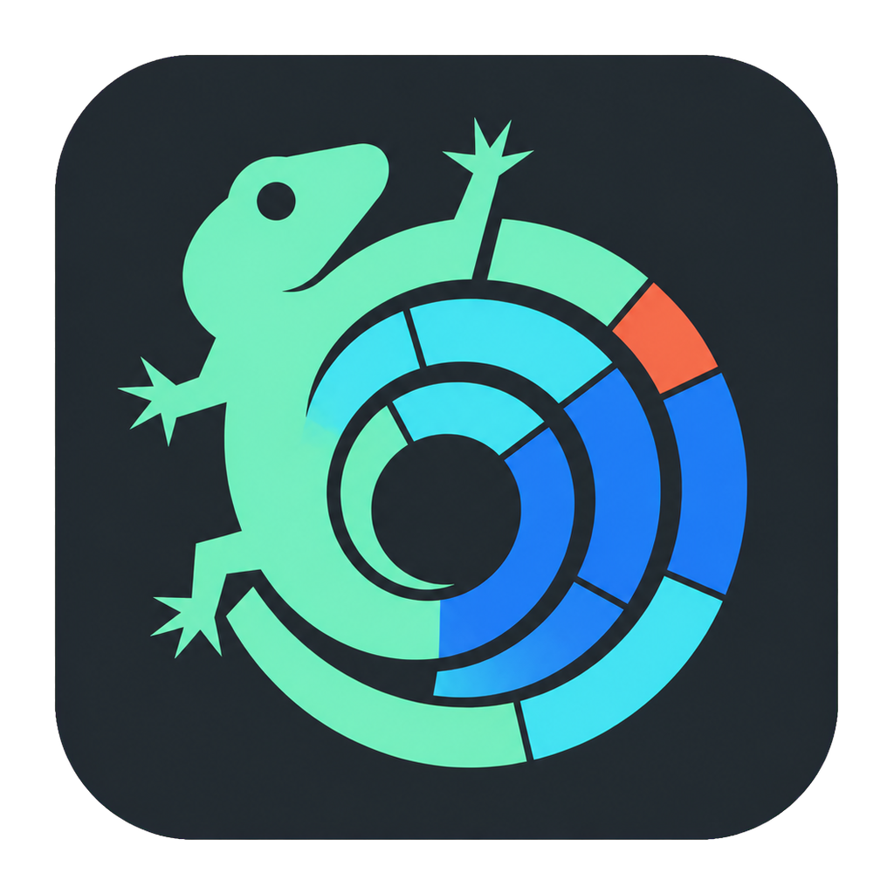
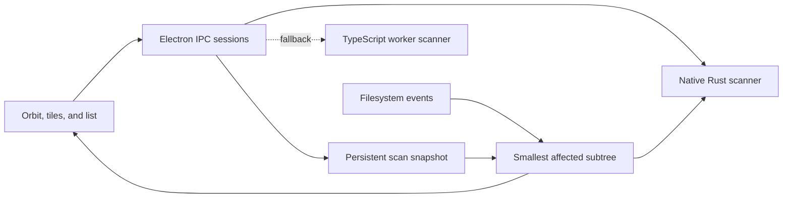

<p align="center">
  
</p>

<h1 align="center">DiskLizard</h1>

<p align="center">
  A fast, live disk map built for modern development machines.
</p>

DiskLizard turns a drive or folder into an interactive storage map. It shows where space is going, identifies developer artifacts such as dependencies and build output, and gives you a deliberate path from inspection to cleanup.

The desktop app uses Electron and Solid. A native Rust scanner performs the first traversal, while persistent snapshots and filesystem events keep completed maps current without starting over after every change.

> [!NOTE]
> DiskLizard is under active development. The scanner, desktop experience, and safety model are functional, but packaged releases are not yet published from this repository.

## Why DiskLizard

General-purpose disk tools can tell you that a directory is large. Developer machines need more context: whether that directory is generated, how it can be recreated, whether it belongs to an active worktree, and whether an agent stores important state inside it.

DiskLizard adds that context without turning cleanup into an automatic or destructive process.

- **Visual exploration** — move between an orbit map, proportional tiles, and a sortable list.
- **Developer awareness** — surface dependencies, build output, toolchain caches, coding-agent state, worktrees, and version-control data.
- **Fast native traversal** — use a release-built Rust scanner with a TypeScript worker fallback.
- **Live maps** — persist scan snapshots and rescan only affected subtrees when the filesystem changes.
- **Concurrent volumes** — scan up to three mounted volumes at once, with independent progress and cancellation.
- **Accurate cleanup numbers** — prefer allocated size on macOS and Linux, and avoid double-counting hard links.
- **Reviewed cleanup** — drag items into a cleanup list, inspect the complete selection, then move approved items to the operating system Trash or Recycle Bin.
- **Keyboard access** — browse, preview, collect, change views, rescan, and move upward without leaving the keyboard.

## Developer lens

DiskLizard recognizes common storage patterns and explains what they mean. Recognition is guidance, not permission to delete: ambiguous names remain review-first, and sensitive categories are protected.

| Category          | Examples                                                | DiskLizard's treatment                                                                |
| ----------------- | ------------------------------------------------------- | ------------------------------------------------------------------------------------- |
| Dependencies      | `node_modules`, `vendor`, `Pods`, virtual environments  | Explains how the project can restore them and flags ambiguous cases                   |
| Build output      | Rust `target`, `dist`, `build`, `.next`, DerivedData    | Separates clearly generated output from folders that need inspection                  |
| Toolchain data    | Gradle, Maven, Cargo, npm, pnpm, Bun, Xcode, IDE caches | Distinguishes disposable caches from configuration-bearing directories                |
| Coding agents     | `.codex`, `.claude`, `.opencode`, `.cursor`, and others | Makes the storage visible but protects sessions and configuration from direct removal |
| Worktrees and VCS | `worktrees`, `.git`, `.hg`, `.svn`                      | Directs cleanup through the owning tool instead of deleting internal state            |

### Smart developer artifact cleanup

The Developer lens can narrow recognized dependencies, build output, and toolchain caches by ecosystem and an **unchanged for** policy. Ecosystem labels are inferred from the folder name and small, direct-entry signals where they are available; common filters include Node, Python, Rust, JVM, C++, Go, .NET, Dart, and Apple tooling. A generic directory name alone is not treated as proof that it belongs to one of those ecosystems.

Age filtering means **modification time (mtime)**, not last use. For example, “unchanged for at least 30 days” means the scanner did not observe a newer modification time in that subtree; reading a directory does not necessarily update its mtime. Items without a usable modification time do not qualify for an age-limited bulk selection.

Only recognized regenerable or redownloadable artifacts with sufficient local evidence are eligible for **Select eligible for review**. Conventional but ambiguous names such as `build`, `target`, `dist`, and `vendor` remain visible, but stay review-only unless their local shape provides stronger evidence. Eligible is a selection posture, not a delete verdict: it fills the same review list used elsewhere in DiskLizard.

For scans that need more coverage than the visual map, the scanner can also build an opt-in, bounded deep developer-artifact inventory. It indexes recognized folders independently of the map's depth and child limits while keeping the rendered tree compact. This is a catalog of supported patterns, not a claim to find every possible generated folder on every filesystem. Its status says whether the observed scope is complete or partial, and reports capped results, unreadable locations, explicit exclusions, and skipped symlinks rather than silently treating those areas as empty. Nested matches can overlap (for example, a dependency folder containing another dependency folder), so DiskLizard removes descendants of an already-selected root before totaling or adding a bulk selection.

## How it works



The initial scan enumerates metadata rather than reading file contents. On completion, DiskLizard stores a compact tree and a watcher checkpoint. Later filesystem events are coalesced into the smallest materialized subtrees that can be rescanned safely. If the event history is too large or ambiguous, DiskLizard falls back to a broader rescan instead of presenting stale totals.

DiskLizard does not depend on private APFS checksums. APFS internal hashes are not a public directory-change index; persisted snapshots plus native filesystem events provide the useful behavior without relying on undocumented filesystem internals.

On APFS, the native scanner records clone evidence only when the filesystem exposes it and charges a full-clone group once only when every member is proven to be inside the scan. A hard link or clone pathname is therefore never presented as a per-path reclaim guarantee. If native clone metadata is unavailable, DiskLizard keeps the map useful for inspection but pauses reclaim estimates and re-accounts after a removal rather than inventing freed space.

## Safety model

The first pass is read-only with respect to the scanned volume. Cleanup is always a separate, explicit operation.

1. Select or drag an item into the cleanup list.
2. Review every selected path and its combined size.
3. Confirm the operation.
4. DiskLizard asks the operating system to move the item to Trash or Recycle Bin.

DiskLizard blocks direct removal of filesystem roots, mounted-volume roots, whole home/profile directories, operating-system locations, Trash internals, version-control metadata, worktrees, and coding-agent state. Symlink targets are resolved and checked again before an operation is allowed.

Smart cleanup follows that same review-to-Trash or Recycle Bin path; it never automatically removes a directory merely because its name resembles a cache or build folder. A listed size is a scan measurement, not a guarantee of storage reclaimed after removal, especially where the filesystem shares storage between paths.

## Run locally

### Prerequisites

- [Bun](https://bun.sh/) 1.3 or newer
- A stable [Rust toolchain](https://rustup.rs/)
- The native build tools for your operating system, such as Xcode Command Line Tools on macOS

### Development

```bash
git clone <your-repository-url> disklizard
cd disklizard
bun install
bun dev:desktop
```

The first desktop launch builds the native scanner in release mode, so it takes longer than subsequent launches. Development uses the `dev` icon and application-data namespace.

To run only the terminal interface:

```bash
bun disklizard
bun disklizard ~/Library
```

On Windows, quote paths containing spaces:

```powershell
bun disklizard "C:\Users\you\Projects"
```

## Build and package

Build the native scanner and Electron application:

```bash
bun run --cwd packages/desktop build
```

Create an installer for the current platform:

```bash
# macOS
bun run --cwd packages/desktop package:mac

# Windows
bun run --cwd packages/desktop package:win

# Linux
bun run --cwd packages/desktop package:linux
```

Packaged artifacts are written to `packages/desktop/dist`.

## Useful commands

| Command                                          | Purpose                                                    |
| ------------------------------------------------ | ---------------------------------------------------------- |
| `bun dev:desktop`                                | Build prerequisites and start the Electron development app |
| `bun disklizard [path]`                          | Run the terminal disk browser                              |
| `bun run --cwd packages/disklizard native:build` | Build and copy the release Rust scanner                    |
| `bun run --cwd packages/disklizard native:test`  | Run native scanner tests                                   |
| `bun run --cwd packages/desktop benchmark:disk -- --path <path>` | Explicit, read-only scan measurement with backend and throughput |
| `bun run --cwd packages/app typecheck`           | Type-check the renderer                                    |
| `bun run --cwd packages/desktop typecheck`       | Type-check Electron main, preload, and renderer code       |

Do not use the root `bun test` command; this workspace intentionally requires tests to be run from the relevant package.

The benchmark command always requires a target path and runs one read-only scan. Its report identifies whether the native scanner or TypeScript fallback actually ran, along with elapsed time, entry counts, and byte throughput; it does not start Electron or imply a hardware-independent speed claim.

```bash
(cd packages/app && bun test)
(cd packages/desktop && bun test)
bun run --cwd packages/disklizard native:test
```

## Platform behavior

| Platform | Scanning            | Live updates                        | Cleanup destination | Size accounting                                      |
| -------- | ------------------- | ----------------------------------- | ------------------- | ---------------------------------------------------- |
| macOS    | Native Rust scanner | FSEvents through the native watcher | Trash               | Allocated size when available                        |
| Linux    | Native Rust scanner | Native filesystem watcher           | Trash               | Allocated size when available                        |
| Windows  | Native Rust scanner | Native filesystem watcher           | Recycle Bin         | File length where allocation metadata is unavailable |

Permissions still apply. Files and folders the current user cannot read are counted as scan issues and surfaced in the result instead of silently being treated as empty. Network volumes, sleeping disks, antivirus software, and very slow removable media can materially affect traversal speed.

## Keyboard shortcuts

| Shortcut                           | Action                                                  |
| ---------------------------------- | ------------------------------------------------------- |
| `↑` / `↓` or `J` / `K`             | Move through items; `Shift` adds the inclusive range to review |
| `Home` / `End`, `Page Up` / `Down` | Jump to an edge or one visible page; `Shift` adds the range to review |
| `←` / `→`                          | Move up one level / open the focused folder             |
| `Enter`                            | Open a folder or preview a file                         |
| `Space`                            | Preview the selected item (Quick Look on macOS when available) |
| `Escape` or `Backspace`            | Move up one level; cancel an active foreground scan     |
| `C`                                | Add or remove the selected item from the cleanup list   |
| `Delete` or `⌘/Ctrl` + `Backspace` | Review moving the selected item to Trash or Recycle Bin |
| `⌘/Ctrl` + `R`                     | Rescan the current location                             |
| `1`, `2`, `3`                      | Switch between orbit, tiles, and list views             |

## Repository layout

```text
packages/
  app/src/pages/disk-utility/     Desktop interface and storage intelligence
  desktop/                        Electron main process, preload, IPC, snapshots
  disklizard/
    native-scanner/               Rust traversal engine
    src/                           Shared tree model, fallback scanner, safety, TUI
```

The repository currently derives its desktop shell and workspace structure from [OpenCode](https://github.com/anomalyco/opencode). DiskLizard-specific scanning and interface code lives in the packages listed above.

## License

[MIT](LICENSE)
